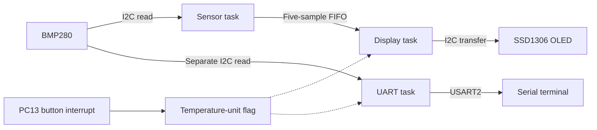

# STM32 BMP280 Weather Station

Embedded C firmware for a NUCLEO-F446RE that reads temperature and barometric pressure, renders both on an SSD1306 OLED, and streams readings over UART. FreeRTOS separates acquisition, display, and serial output; the onboard button switches between Celsius and Fahrenheit.

The project demonstrates register-level sensor integration through the STM32 HAL, fixed-point sensor compensation, RTOS task design, queue-based communication, shared I2C access, and interrupt-driven input.


## Start with the application code

| File | Responsibility |
| --- | --- |
| [weather_station.c](Core/Src/weather_station.c) | RTOS setup, application tasks, sample queue, I2C mutex, and temperature-unit selection. |
| [bmp280.c](Core/Src/bmp280.c) | Sensor configuration, calibration decoding, raw measurements, and compensated temperature/pressure. |
| [ssd1306.c](Core/Src/ssd1306.c) | OLED initialization, framebuffer, 5×7 font, text rendering, and screen transfers. |
| [main.c](Core/Src/main.c) | HAL startup, clock/peripheral configuration, scheduler startup, and the button callback bridge. |
| [stm32f4xx_it.c](Core/Src/stm32f4xx_it.c) | Exception handlers, RTOS tick integration, and EXTI dispatch. |
| [FreeRTOSConfig.h](Core/Inc/FreeRTOSConfig.h) | Scheduler, tick, heap, and interrupt-priority configuration. |
| [tests/](tests/) | Host-side regression tests, separate from the firmware cross-build. |

Public application and driver interfaces live alongside the code in [Core/Inc/](Core/Inc/). The repository includes the STM32 HAL, CMSIS, and FreeRTOS sources needed to build; no submodule checkout is required.

## How it works

The BMP280 runs in normal mode with ×1 temperature and pressure oversampling. Its factory calibration coefficients convert raw register values into degrees Celsius and hPa. Celsius remains the measurement unit internally; display and UART formatting apply Fahrenheit conversion when selected.



| Task | CMSIS-RTOS2 priority | Work and scheduling |
| --- | --- | --- |
| Sensor | Above normal | Reads the BMP280, tries to enqueue a sample, then delays 500 ticks. |
| Display | Normal | Blocks on the queue, renders one sample, and toggles the green LD2 LED. |
| UART | Normal | Reads the BMP280 independently, transmits a formatted line, then delays 1,000 ticks. |
| `defaultTask` | Normal | Retained CubeMX task; sleeps for 1,000 ticks per iteration. |

The configured tick rate is 1 kHz. These delays are approximately 500 ms and 1 s **after each task's work**; they are not fixed-rate deadlines.

**Shared bus:** BMP280 reads and OLED updates use the same I2C1 mutex once the scheduler is running. A lock covers each complete sensor read or display update, keeping their transactions from interleaving. Peripheral initialization occurs before task execution.

**Queue policy:** The display receives samples through a five-element FIFO. Sending never waits; a full queue drops the new sample and retains the samples already queued. UART does not consume or peek at this queue, so its readings may differ from those on the display.

**Button input:** A falling edge on PC13 toggles the shared unit flag. The interrupt performs no I2C or UART work; each output uses the selection on its next update.

## Hardware and wiring

- NUCLEO-F446RE development board (STM32F446RE, Cortex-M4; firmware configures an 84 MHz system clock).
- BMP280 temperature/pressure module with a 7-bit I2C address of `0x76`.
- SSD1306 128×64 I2C OLED with a 7-bit address of `0x3C`.
- Breadboard, jumper wires, and a USB connection to the board's ST-LINK connector.

| Connection | NUCLEO-F446RE pin | Notes |
| --- | --- | --- |
| BMP280 and OLED power | 3.3 V / GND | Both modules share power and ground. |
| BMP280 and OLED SCL | PB8 | Shared I2C1 clock, configured at 100 kHz. |
| BMP280 and OLED SDA | PB9 | Shared I2C1 data. |
| USART2 TX / RX | PA2 / PA3 | Serial output uses TX; the board exposes a ST-LINK virtual COM port. |
| Blue user button B1 | PC13 | Onboard connection; falling-edge EXTI input. |
| Green user LED LD2 | PA5 | Onboard connection; toggles after a display sample is processed. |

I2C GPIOs are configured without internal pull-ups. The bus needs pull-ups to 3.3 V, provided by the modules or external wiring. Match the module addresses above; the drivers pass the left-shifted address format required by the HAL.

## Build and run

Install these tools and make them available on `PATH`:

- Arm GNU Toolchain (`arm-none-eabi-gcc`).
- CMake 3.22 or newer and Ninja.
- OpenOCD for flashing through ST-LINK.
- A serial terminal for viewing UART output.

STM32CubeMX is only needed when changing the peripheral configuration in [trying_vscode.ioc](trying_vscode.ioc). An IDE is optional.

### Build the firmware

```bash
git clone https://github.com/dreamingofu/stm32-bmp280-weather-station.git
cd stm32-bmp280-weather-station

cmake --preset Debug
cmake --build --preset Debug

cmake --preset Release
cmake --build --preset Release
```

The presets use the checked-in Arm GCC toolchain and STM32F446 linker script. Debug uses `-O0 -g3`; Release uses `-Os -g0`. Outputs are `build/Debug/trying_vscode.elf` and `build/Release/trying_vscode.elf`. The artifact name retains the original CubeMX project name.

### Flash and observe

Connect the board through ST-LINK, then flash the Debug image:

```bash
openocd -f interface/stlink.cfg -f target/stm32f4x.cfg \
  -c "program build/Debug/trying_vscode.elf verify reset exit"
```

Open the ST-LINK virtual COM port at **115200 baud, 8 data bits, no parity, 1 stop bit, no flow control**. Reset the board to see the startup message. Output follows this format; values below are illustrative:

```text
FreeRTOS Weather Station starting...
Temp: 24.69 C  Pressure: 1019.74 hPa
Temp: 76.44 F  Pressure: 1019.72 hPa
```

The OLED shows temperature, pressure, and the selected unit. Press B1 to change the unit on subsequent OLED and UART updates.

<details>
<summary>Existing hardware demonstration</summary>


[Celsius photo](images/Celsius.JPG) · [Fahrenheit photo](images/Fahrenheit.JPG) · [Board photo](images/Nucleo%20Board.JPG)

</details>

### Run host tests

With a native C compiler, CMake, and Make installed (or add `-G Ninja` to the configure command to use Ninja in a fresh build directory):

```bash
cmake -S tests -B build/tests
cmake --build build/tests
ctest --test-dir build/tests --output-on-failure
```

The three host suites cover BMP280 compensation and I2C transactions, SSD1306 initialization and text rendering, and task configuration, queue policy, mutex boundaries, and Celsius/Fahrenheit output. Driver fixtures were checked against the pre-refactor implementation.

These tests run without connected hardware. Firmware cross-builds and on-board checks remain separate: verify sensor readings, OLED output, UART output, button behavior, and continued operation after flashing. The checked-in photos and GIF document the existing hardware demonstration, not a new validation run of every revision.

## Validation

Local validation on September 10, 2026 used Arm GNU Toolchain 15.3.1 and CMake 4.4.2. Both firmware presets built without warnings. Linker-reported memory use:

| Build | Flash used / 512 KiB | RAM used / 128 KiB |
| --- | --- | --- |
| Debug | 48,948 bytes | 22,384 bytes |
| Release | 34,836 bytes | 22,376 bytes |

All three host test suites passed with Apple Clang 21.0.0, including a Release build with checks active. The task behavior harness also passed against the original task bodies before extraction.

These are build measurements, not runtime stack high-water marks or timing measurements. The refactored firmware has not been revalidated on the board.

## Current scope and limitations

- HAL I2C/UART calls are blocking. There is no peripheral error-recovery or disconnected-sensor workflow, and no DMA-based transfer path.
- The button has no software debounce, so contact bounce can trigger multiple unit changes.
- The queue preserves FIFO order rather than guaranteeing that the display always receives the newest sample.
- UART acquires its own sample rather than sharing the display's sample. Task delays include execution and bus-wait time, so the project makes no hard real-time deadline guarantee.
- Pressure is reported as measured barometric pressure; there is no altitude correction, weather forecasting, or persistent logging.

These boundaries keep the current project focused on peripheral integration and RTOS coordination. Error handling, debounce, and timing measurements are natural next steps.

## Project history and attribution

The Git history contains the original polling-loop implementation (`b96f127`) and its transition to separate FreeRTOS tasks (`550d635`). Application and sensor code now live in dedicated modules so the control flow can be reviewed separately from board initialization.

STM32CubeMX supplies the peripheral scaffolding, startup support, and generated build configuration. [Drivers/](Drivers/) contains STMicroelectronics HAL and Arm CMSIS code; [Middlewares/Third_Party/FreeRTOS/](Middlewares/Third_Party/FreeRTOS/) contains the FreeRTOS kernel and CMSIS-RTOS2 integration. BMP280 compensation follows the algorithm in the [Bosch BMP280 datasheet](https://www.bosch-sensortec.com/media/boschsensortec/downloads/datasheets/bst-bmp280-ds001.pdf). Existing third-party notices and license files remain with their components:

- [STM32 HAL license](Drivers/STM32F4xx_HAL_Driver/LICENSE.txt)
- [CMSIS license](Drivers/CMSIS/LICENSE.txt) and [STM32 device license](Drivers/CMSIS/Device/ST/STM32F4xx/LICENSE.txt)
- [FreeRTOS license](Middlewares/Third_Party/FreeRTOS/Source/LICENSE)

No repository-wide license is currently specified for the application code.
